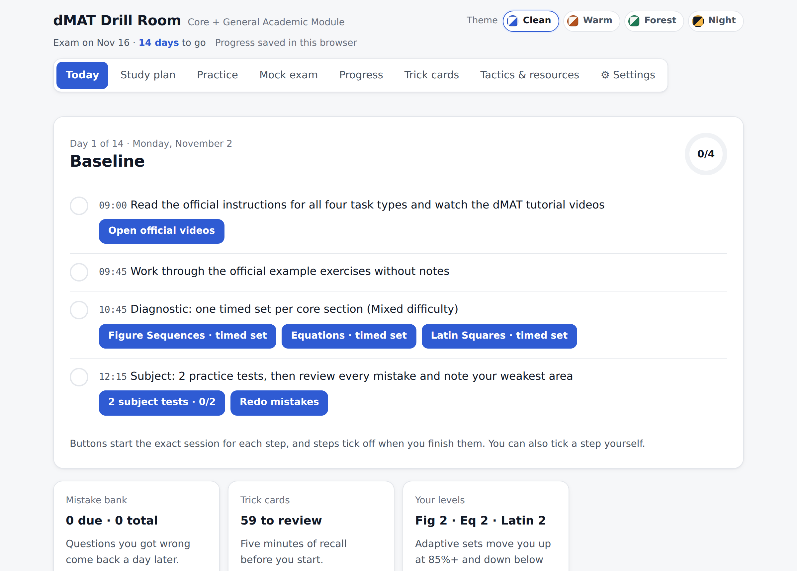
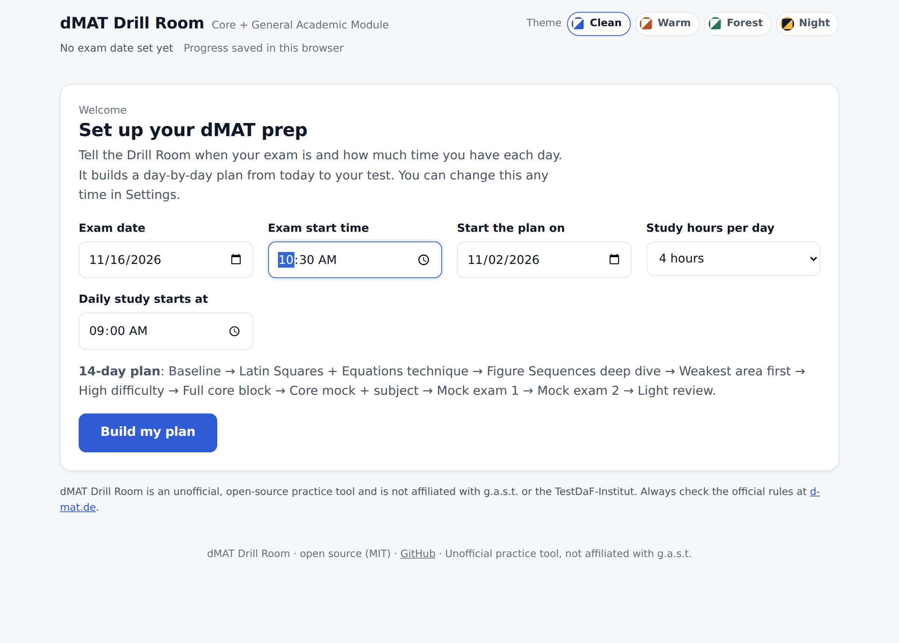
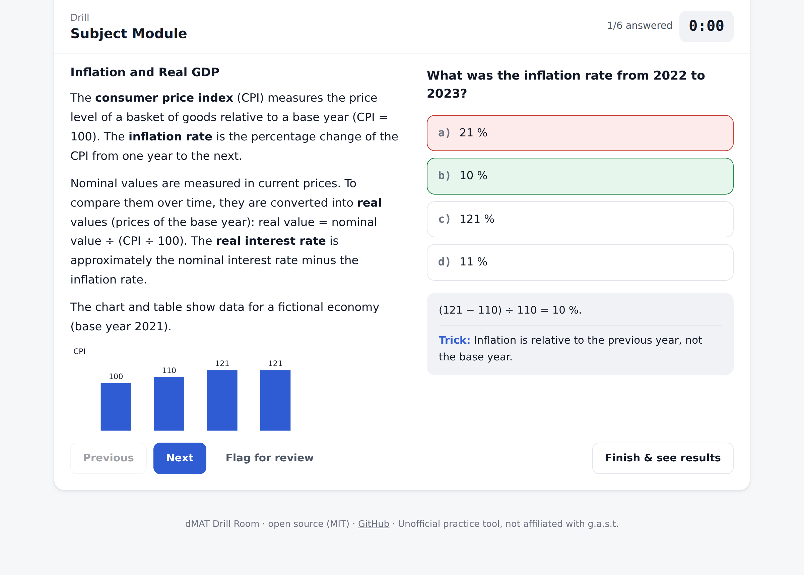
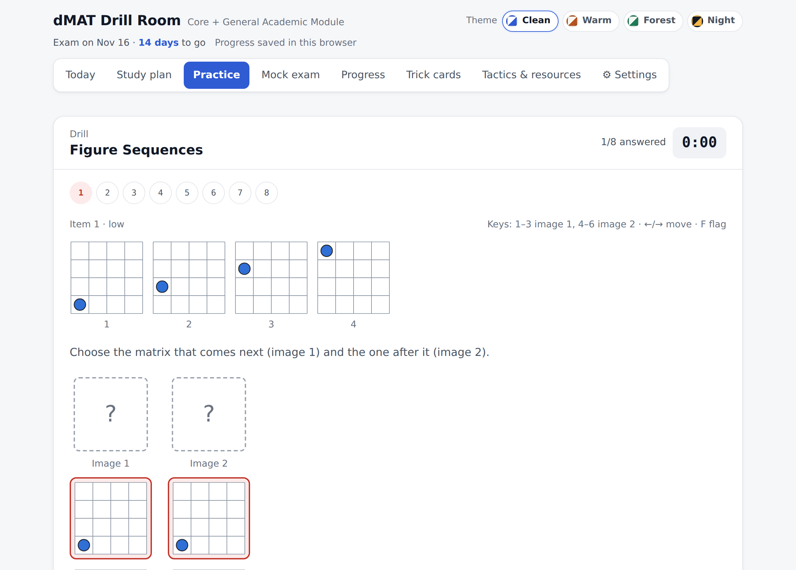
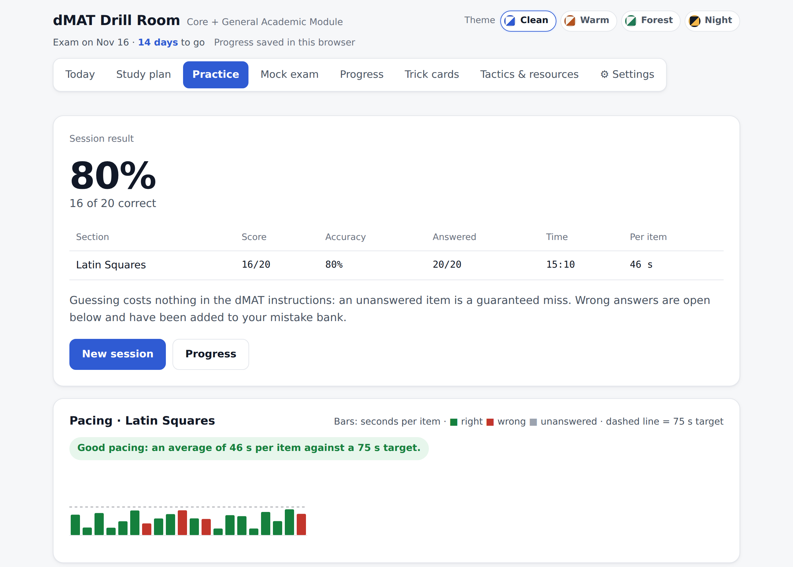
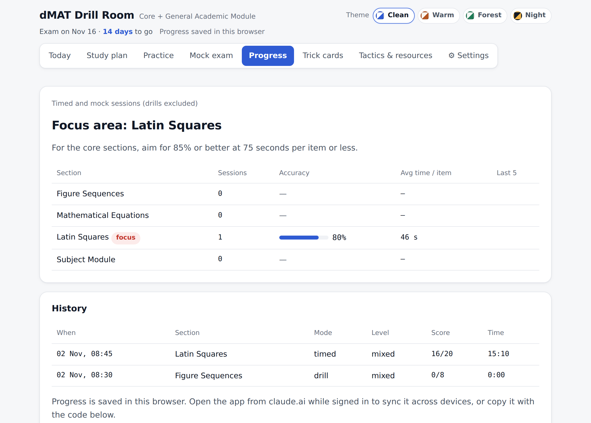
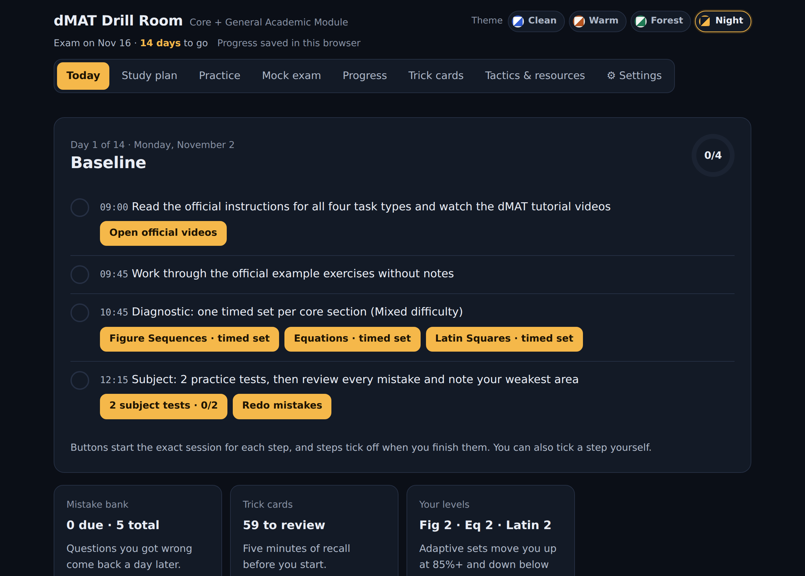
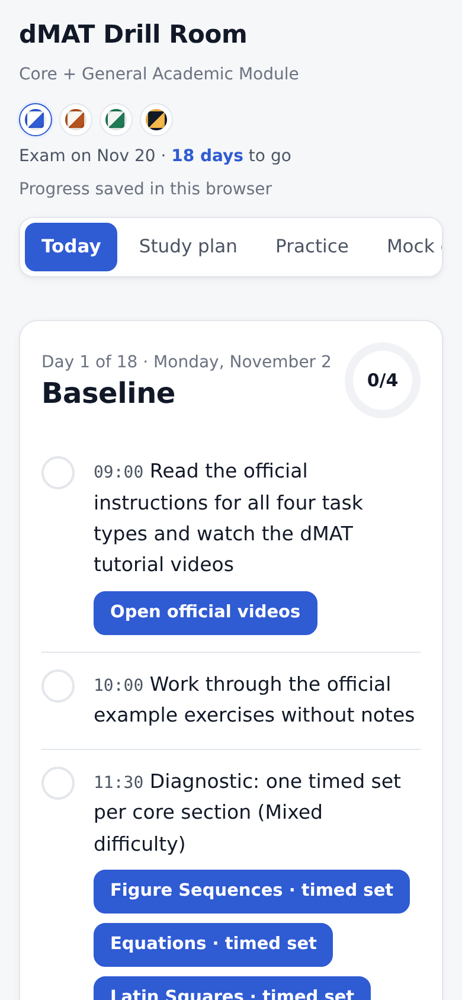

# 🧩 dMAT Drill Room

**A free, open-source practice app for the dMAT (digital Master Test).** Enter your exam date, and it builds a day-by-day study plan, generates unlimited core-module puzzles, runs timed mock exams and tracks your weak spots. Everything runs in a single HTML file: no install, no account, no server.

> **Unofficial.** This project is not affiliated with g.a.s.t. or the TestDaF-Institut, and the questions are not official dMAT items. Always check the latest rules and materials at [d-mat.de](https://www.d-mat.de/en/).



---

## Contents

- [What's inside](#whats-inside)
- [Quick start](#quick-start)
- [Setting your exam date](#setting-your-exam-date)
- [How to use it well](#how-to-use-it-well)
- [Screenshots](#screenshots)
- [Your data](#your-data)
- [Project structure](#project-structure)
- [Contributing](#contributing)
- [License](#license)

## What's inside

The dMAT has a **Core Module** (Figure Sequences, Mathematical Equations and Latin Squares, each 20 items in 25 minutes) and a **Subject Module** (academic texts with single-choice questions, 90 minutes). No notes are allowed. The Drill Room trains both.

| Feature | What it does |
|---|---|
| **Study plan built around your date** | Enter your exam date, start date and daily hours, and get a plan of 1–60 days: baseline → technique → weak areas → high difficulty → core blocks → mocks → light review. |
| **Today screen** | Opens on today's steps. Each step has a button that starts the right session and ticks itself off when you finish. |
| **Unlimited core puzzles** | Generated Figure Sequences (4×4 grids, movement, rotation, colour and *x + 1* rules), Mathematical Equations (values 1–20, one unique solution) and Latin Squares (5×5, one unique answer, step-by-step solution path). |
| **Adaptive difficulty** | Three levels. You move up after a set at 85% or better and down after one below 60%. |
| **Subject Module bank** | 38 original texts with 228 questions across 8 subjects: maths, statistics, physics/engineering, chemistry/biology, economics, business, computer science, social sciences/humanities. Six question types: calculation, table/chart reading, concept check, I/II/III statements, EXCEPT, and transfer scenarios. |
| **Exam and Learn modes** | Review at the end, or see the answer plus the trick behind it after every question. |
| **Mock exams** | Two full mocks (3 × 25 min core → 30 min break → subject set), plus unlimited core-only mocks. |
| **Mistake bank** | Every wrong answer comes back a day later. It leaves the bank after two correct answers in a row. |
| **Pacing feedback** | A seconds-per-item chart plus warnings for rushing, overthinking and running out of time. Timed sets show a live "on pace" badge. |
| **Trick cards** | 59 recall cards with spaced repetition (1 → 3 → 7 → 14 days). |
| **Exam-day mode** | Hides hints, labels and feedback until the end, just like the real test. |
| **Keyboard shortcuts** | `A–E` Latin squares · `1–4`/`A–D` subject · `1–6` figures · `←/→` move · `F` flag · `Enter` check / next. |
| **Four themes** | Clean (follows system light/dark), Warm, Forest and Night. |
| **Works on phones** | Responsive layout and large tap targets. Install it from the browser menu ("Add to Home Screen") to get an app icon and full offline use. |

## Quick start

**Option 1: just open it**

1. [Download the ZIP](../../archive/refs/heads/main.zip), or clone the repo:
   ```bash
   git clone https://github.com/PaddyCH96/dmat-drill-room.git
   ```
2. Double-click `index.html`. It opens in your browser and works offline, apart from the web fonts, which fall back to system fonts.

**Option 2: use the hosted version**

If the repo owner has enabled GitHub Pages, open **https://paddych96.github.io/dmat-drill-room/**.

**Install it on a phone**

Open the hosted version in Chrome or Safari and choose "Add to Home Screen". After the first visit it works offline — useful on a commute, and it keeps the browser's tabs and notifications out of your practice.

**Option 3: host your own copy**

Fork the repo → **Settings → Pages** → *Deploy from a branch* → `main` / `(root)` → **Save**. Your copy will be live at `https://<your-username>.github.io/dmat-drill-room/` in a minute or two.

## Setting your exam date

The first time you open the app, it asks for:

| Field | Used for |
|---|---|
| **Exam date** and **start time** | The countdown and the exam-day screen |
| **Start the plan on** | Day 1 of your plan (defaults to today) |
| **Study hours per day** (1–8) | Spacing the day's steps. Days under 4 hours get fewer repeat sets. |
| **Daily study starts at** | The times shown on each step |



You can change any of these later in **⚙ Settings**. Your scores, mistake bank and cards are kept. Plans shorter than 9 days keep the most valuable days (baseline, Figure Sequences, Mock 1, light review), and longer plans add extra weak-area, high-difficulty and core-mock days. The longest plan is 60 days.

## How to use it well

1. **Day 1:** read the [official preparation materials and videos](https://www.d-mat.de/en/preparation-for-the-exam/), then do the diagnostic sets. Your first results set your level and start filling the mistake bank.
2. **Every day:** start with 5 minutes of **Trick cards**, follow the **Today** screen, and finish with **Redo mistakes**.
3. **Never take notes**, not even in practice. The real exam doesn't allow them.
4. **Guess rather than skip.** An unanswered item is always wrong.
5. **Weight your subject practice** toward fields outside your own background. You can't choose topics in the General Academic Module.
6. **Take the mocks in exam-day mode** in one sitting, ideally at the same time of day as your real test.

## Screenshots

| Subject Module (Learn mode) | Figure Sequences drill |
|---|---|
|  |  |

| Results with pacing | Progress |
|---|---|
|  |  |

| Night theme | Mobile |
|---|---|
|  |  |

## Your data

- Progress is saved in your browser's `localStorage`. Nothing is sent anywhere.
- To move to another browser or device, use **⚙ Settings → Copy backup code**, then **Import code** on the other device.
- **Reset all progress** in Settings clears scores, mistakes and cards. It keeps your exam setup.
- *Optional:* if you publish `index.html` as a [Claude](https://claude.ai) artifact with the `db`, `user` and `sample` capabilities, progress syncs to your Claude account and every explanation gets an **"Explain it differently"** button. Outside Claude, these features simply stay hidden.

## Project structure

```
dmat-drill-room/
├── index.html                  ← the built app (open this)
├── sw.js                       ← service worker (generated; offline support)
├── manifest.webmanifest        ← makes it installable on phones
├── icons/                      ← app icons
├── build.mjs                   ← bundles src/ into index.html and sw.js
├── tests/check.mjs             ← checks the question bank, generators and planner
├── src/
│   ├── styles.html             ← CSS and themes
│   ├── layout.html             ← page shell (header, tabs, footer)
│   ├── generators.js           ← Figure Sequences, Equations, Latin Squares
│   ├── questions-1/2/3.js      ← Subject Module texts and questions
│   ├── subjects-and-tricks.js  ← subject areas, question types, trick cards
│   ├── plan.js                 ← setup screen and study-plan builder
│   ├── app.js                  ← sessions, practice, mocks, progress, sync
│   └── features.js             ← Today screen, mistake bank, pacing, shortcuts
└── docs/screenshots/
```

To make changes, you need [Node.js](https://nodejs.org) 18 or newer. There are no packages to install.

```bash
node build.mjs          # rebuild index.html and sw.js after editing src/
node tests/check.mjs    # run the checks
```

## Contributing

New subject texts, trick cards and bug fixes are very welcome. See [CONTRIBUTING.md](CONTRIBUTING.md) for the question format and workflow. Please only submit **original** material: don't copy official dMAT or TestAS items.

If this helped you prepare, a ⭐ helps other candidates find it.

## License

[MIT](LICENSE) © 2026 PaddyCH96
